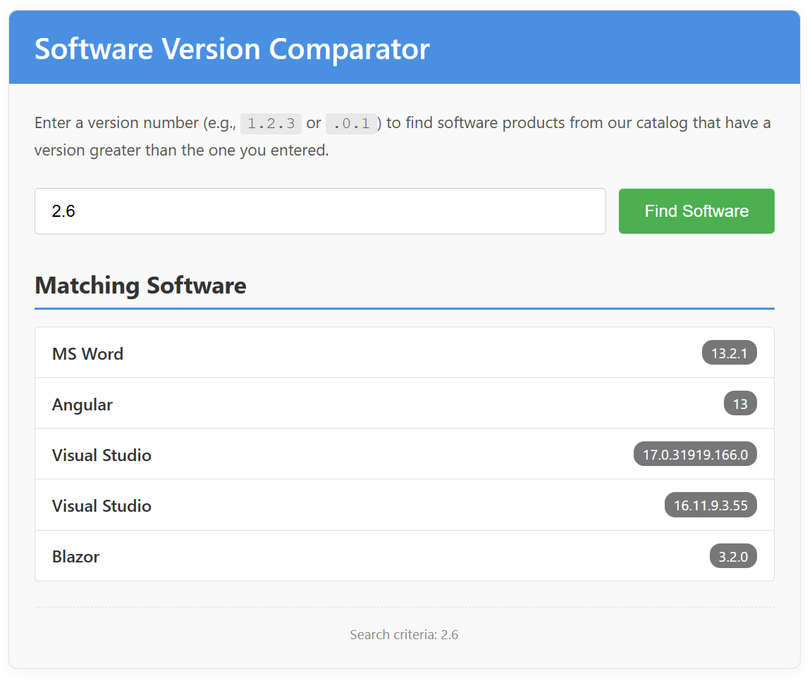

# Software Version Comparator (Emergent Software Challenge)

This repository contains a solution to the Emergent Software code challenge. The project implements a "Software Version Comparator" application with two distinct front-end versions:

1.  A **Blazor Web App** that interacts with a minimal backend API.
2.  A **Static HTML/JavaScript/CSS Page** providing similar functionality, entirely client-side.

---

## 🚀 Live Demo (Static Version)

You can try out the static HTML/JavaScript version of the comparator here:

**➡️ Visit [https://jinnfletch.github.io/TestTemplate/](https://jinnfletch.github.io/TestTemplate/) to test the static version! (Click the footer cog!)**

---

## 🎯 The Challenge

The core task was to create an application where users can input a software version number. The application should then:
*   Validate the entered version string.
*   Display an error if the version is invalid.
*   If valid, query a predefined list of software products.
*   Display all software products from the list whose versions are strictly greater than the version entered by the user.

### Version Format
The software versions follow a custom 5-part format: `[major].[minor].[patch].[build].[compilation]`.
*   Each part is a non-negative integer.
*   Periods are separators only.
*   Shorter versions are padded with zeros for comparison (e.g., "2" is equivalent to "2.0.0.0.0").
*   Special handling for leading dots (e.g., `.1.2` implies a right-aligned or suffix match).

---

## ✨ Features Implemented

*   **User-Friendly Interface:** Clean and intuitive UI for entering versions and viewing results.
*   **Robust Version Parsing:** Handles various valid version formats, including partial versions and versions with leading/trailing dots as per the specified rules.
*   **Comprehensive Input Validation:** Provides clear error messages for invalid version strings.
*   **Accurate Version Comparison:** Correctly compares 5-part versions to filter the software list.
*   **Clear Results Display:** Shows matching software (name and version) or a "no results found" message.
*   **Handling of Catalog Data Inconsistencies:** Informs the user if some versions from the source catalog cannot be parsed.
*   **Loading Indicators:** Provides feedback during data fetching or processing.
*   **Responsive (Basic):** The static page and Blazor app are designed to be usable on different screen sizes.

---

## 🛠️ Project Structure (Blazor Version)

The Blazor solution is structured with a separation of concerns:

*   **`SoftwareVersioner.Core`**: Contains shared models (like `Software.cs`) and core interfaces.
*   **`SoftwareVersioner` (Domain/Application Layer)**:
    *   `Data/SoftwareManager.cs`: Provides the sample software list as per the challenge.
    *   *(This layer is kept minimal in the final version, with most logic in the client for the Blazor app).*
*   **`SoftwareVersioner.Server`**:
    *   The ASP.NET Core backend hosting the Blazor Web App.
    *   `Controllers/SoftwareController.cs`: A minimal API endpoint (`api/software/all`) that serves the raw software list.
    *   `Components/Layout/NavMenu.razor`: Includes navigation for the Blazor app.
*   **`SoftwareVersioner.Client`**:
    *   The Blazor WebAssembly client project.
    *   `Pages/SoftwareComparator.razor` (mapped to `/`): The main UI for the comparator.
    *   `Services/HttpSvc.cs`: Handles HTTP calls to the backend API.
    *   `Services/FunctionalSvc.cs`: Contains static methods for all client-side version parsing, validation, and filtering logic.
*   **`SoftwareVersioner.Tests`**:
    *   xUnit tests for the client-side logic in `FunctionalSvc.cs`.

---

## 🧪 Running the Blazor Version Locally

1.  Clone the repository.
2.  Open the solution (`SoftwareVersioner.sln` or similar) in Visual Studio or your preferred .NET IDE.
3.  Set `SoftwareVersioner.Server` as the startup project.
4.  Run the application (e.g., press F5 or click the "Run" button).
5.  The application should open in your web browser, with the Software Version Comparator on the home page.

---

## 🔧 Static HTML/JS/CSS Version

The static version is a single `index.html` file (typically located in the `/docs` folder of this repository for GitHub Pages hosting). It implements the same core logic directly in JavaScript within the HTML file.  Click the cog in the [footer of the static demo](https://jinnfletch.github.io/TestTemplate/)!

---

## 💡 Approach & Design Choices

*   **Client-Centric Logic (Blazor):** For the Blazor version, most of the complex logic (version parsing, validation, filtering) was intentionally moved to the client-side (`FunctionalSvc`) to make the backend extremely lightweight and to demonstrate client-side capabilities.
*   **Minimal Backend API:** The server's role is primarily to serve the Blazor app and provide the raw software data via a simple GET request.
*   **Maybe Monad:** Used in the `HttpSvc` for handling potential absence of data or errors from HTTP calls in a more functional style.
*   **CSS Isolation:** Custom styles for Blazor components are co-located with their respective `.razor` files (e.g., `SoftwareComparator.razor.css`).
*   **Testability:** Core logic in `FunctionalSvc` is unit-tested.
*   **Scalability Consideration:** While the current client-side filtering fetches all data, the API design is simple. For very large datasets, the backend API could be extended with server-side filtering and pagination, and the client would adapt to that.

---

Thank you for the opportunity to complete this challenge!